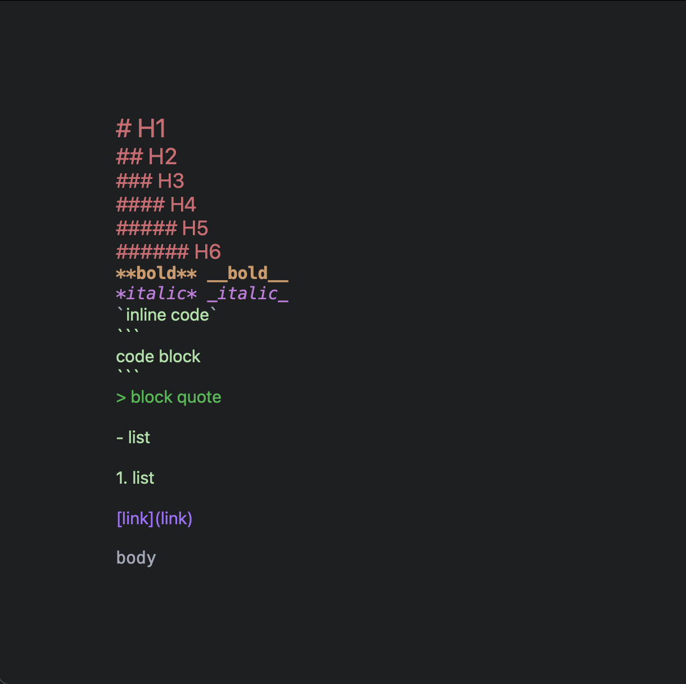
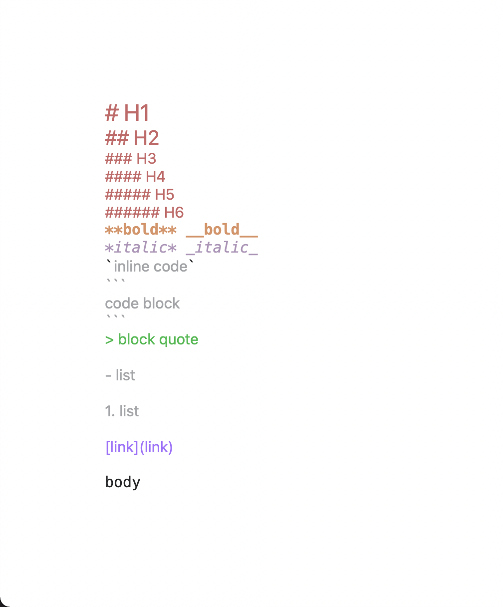

# SwiftDown
[](https://codecov.io/gh/qeude/SwiftDown)

## 📖 Description
A markdown editor component for your SwiftUI apps.

- 🎉 Live preview directly in editor for most of Markdown elements, without web based preview.
- ⚡️ Fast, built on top of [cmark](https://github.com/commonmark/cmark).
- 🗒 Pure markdown, no proprietary format.
- 💻:📱 macOS and iOS support.

<div align=center></div>

## 🛠️ Install
### 📦 Swift Package Manager

Either use Xcode to add the package dependency or add the following dependency to your Package.swift:
```
.package(url: "https://github.com/qeude/SwiftDown.git", from: "0.2.0"),
```

## 🔧 Usage
```swift
import SwiftDown
import SwiftUI

struct ContentView: View {
    @State private var text: String = ""

    var body: some View {
        SwiftDownEditor(text: $text)
            .insetsSize(40)
            .theme(Theme.BuiltIn.defaultDark.theme())
    }
}
```
## 🖌️ Themes

### 🖼 BuildIn themes
#### Default Dark


#### Default Light


### 🧑‍🎨 Custom themes
SwiftDown supports theming by using config `.json` files as [this one](./Sources/SwiftDown/Resources/Themes/default-dark.json)
Then init your custom theme as below.
```swift
Theme(themePath: Bundle.main.path(forResource: "my-custom-theme", ofType: "json"))
```

## 👨🏻‍💻 Author
* Quentin Eude
    * [Github](https://github.com/qeude)
    * [LinkedIn](https://www.linkedin.com/in/quentineude/)
